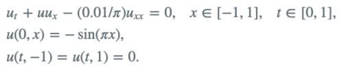

# 版本特性

- DeepONets burgers v1_3

使用PINN数据集

# 项目目的

DeepONets优势：一旦训练完成后，可以更改网络的初始条件U0。即比PINNs多了泛化能力。

DeepONets本质上是在PINNs的基础上，增加一个初始条件U0的输入层。在最坏的情况下，DeepONets应该退化成PINNs。

测试目的：在其余条件与PINNs模型保持一致的情况下，利用DeepONets重新对Burgers方程进行求解。

# 项目贡献

1. 项目主要利用DeepONets，对Burgers方程进行求解。

Burgers方程：

2. 重构项目代码。主要优化项目结构，但是部分代码还存在耦合情况，如predict.py与plot_result.py
3. 数据集。数据集主要采用 [pinns](https://github.com/maziarraissi/PINNs.git) 中的数据集
4. 精度

|              模式               | 精度       |
|:-----------------------------:|----------|
|           deeponets           | 2.3e-02  |
|     修改分支单元数目（b->40,t->40）     | 3.09e-03 |
| 增加ic和bc采样点数目（n_ic->100,n_bc->100） | 1.11e-03   |

结果可以参考文件[deeponets.ipynb](result/burgers_v1_3.ipynb)

5. 总结

    1. 模型结构对精度有影响
    2. 增加ic和bc采样点数目，精度提高
