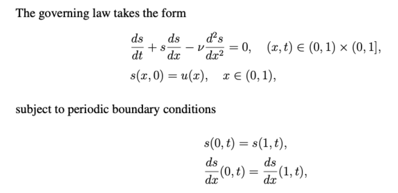

# 项目贡献

1. 项目主要利用DeepONets，对Burgers方程进行求解。

Burgers方程：

2. 重构项目代码。主要优化项目结构，但是部分代码还存在耦合情况，如predict.py与plot_result.py
3. 数据集。数据集主要采用 [DeepONets](https://github.com/PredictiveIntelligenceLab/Physics-informed-DeepONets.git) 中的数据集
4. 精度

|                 模式                  | 精度       |
|:-----------------------------------:|----------|
|       deeponets（burgers_v2_1）       | 2.49e-03 |
|  增加隐藏层神经元个数（burgers_v2_2） 20-->40   | 9.64e-03 |
|  增加trank隐藏层层数（burgers_v2_2） 1-->3   | 3.36e-03 |
|  增加trank隐藏层层数（burgers_v2_2） 3-->7   | 3.38e-03 |
| 增加Adam迭代次数（burgers_v2_2） 500-->5000 | 2.08e-03 |
|    （burgers_v2_3）Adam_iter=20000    | 2.09e-02 |
|  （burgers_v2_4）LBFGS/Adam_iter=500  | 3.38e-03 |
| （burgers_v2_5）LBFGS/Adam_iter=5000  | 2.08e-03 |
| （burgers_v2_6）LBFGS/Adam_iter=5000  | 1.84e-03 |
| （burgers_v2_7）LBFGS/Adam_iter=5000  | 1.87e-03 |
|  （burgers_v2_7）LBFGS/Adam_iter=500  |  |

5. 总结

    1. 提高边缘ic的权重，对结果有促进作用
    2. 增加隐藏层神经元个数，降低了精度
    3. 增加trank隐藏层层数,提高了精度
    4. 增加Adam迭代次数,提高了精度

