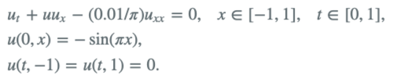

# 项目贡献

1. 项目主要利用PINNs，对Burgers方程进行求解。

Burgers方程：

2. 重构项目代码。主要优化项目结构，但是部分代码还存在耦合情况，如predict.py与plot_result.py
3. 数据集。数据集主要采用 [pinns](https://github.com/maziarraissi/PINNs.git) 中的数据集
4. 精度

|       模式       | 精度       |
|:--------------:|----------|
|    8层blocks    | xxxe-03  |
|    7层blocks    | 2.28e-03 |
| 7层blocks + dam | 1.9e-03  |

5. 总结
   1. 增加blocks层数不一定对结果有促进作用
   2. dam对模型有促进作用
   3. 采用dense模型和u-nets网络可能对结果还有进一步对促进作用。未来精度可以达到e-05左右，详情可以参考[github项目](https://github.com/okada39/pinn_burgers.git)
   